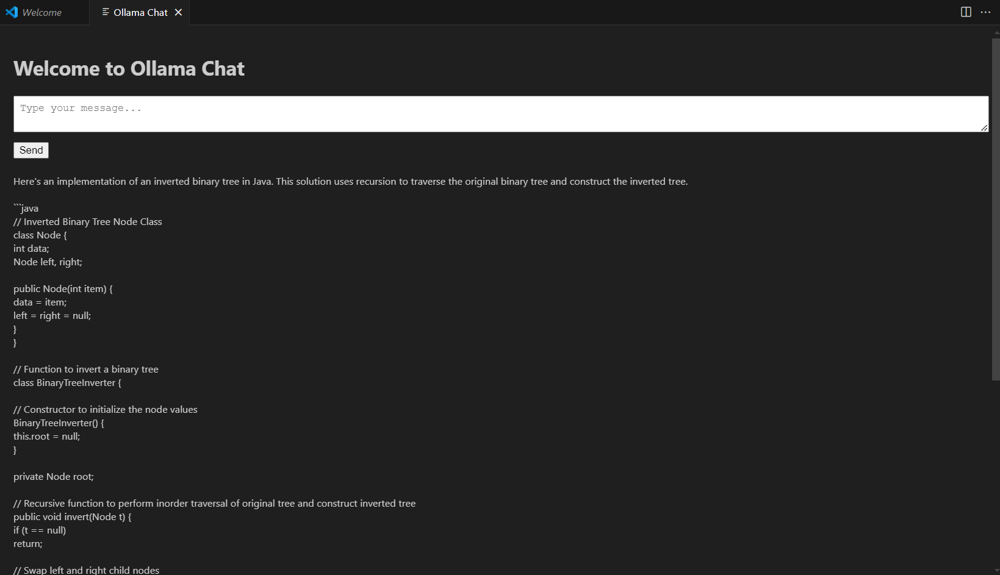

# Offline AI Chat Extension

This is the README for the "Offline AI Chat" extension. This extension allows you to chat with an AI model offline using Ollama.

## Features

- Chat with an AI model directly within VS Code.
- Real-time response updates.
- Simple and intuitive interface.




## Requirements

- Node.js
- Ollama installed and running locally
- Compatible AI model (e.g., `llama3.2`)

## Installation

1. Install Node.js from [nodejs.org](https://nodejs.org/).
2. Install Ollama by following the instructions on [ollama.ai](https://ollama.ai/).
3. Pull the required AI model:
   ```bash
   ollama pull llama3.2